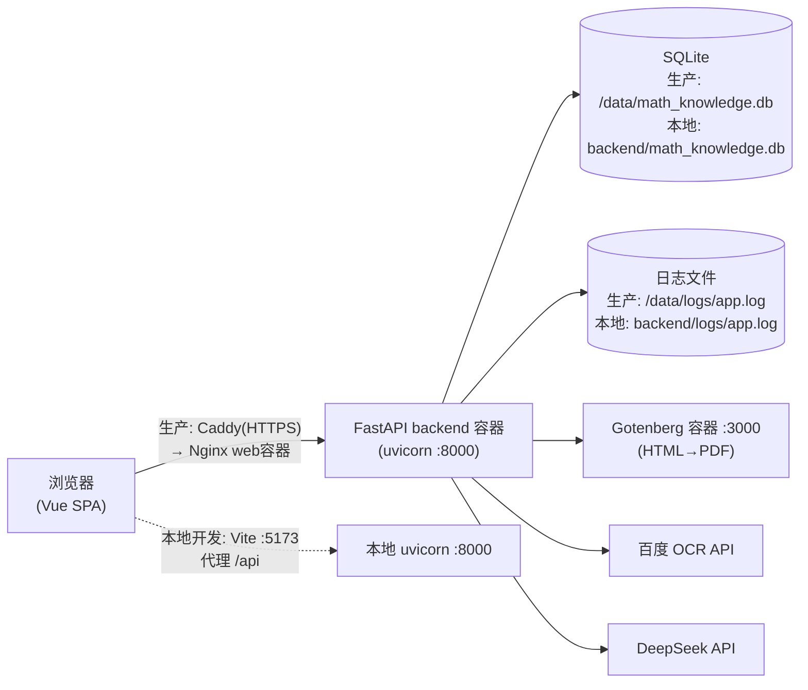

# 排查手册（TROUBLESHOOTING）

本手册写给需要**亲自**排查问题的项目所有者和开发者：系统出问题时按症状找到对应场景，跟着步骤走，就能定位原因并留下可追溯的证据。

配套设施由 Issue #45（日志与请求编号）、#46（前端错误显示）、#47（测试证据管道）建立；本文是它们的使用说明书。

---

## 1. 系统地图



关键点：

- 所有 HTTP 请求都经过 `RequestContextMiddleware`（`backend/app/core/request_context.py`）：每个请求有一个 **请求编号（request_id）**，出现在响应头 `X-Request-ID`、所有后端日志行、500 错误响应体里——它是把"页面现象"和"日志证据"串起来的钥匙。
- 日志双通道：控制台（`docker compose logs backend`）+ 文件（轮转 10MB×10 份）。配置项 `LOG_LEVEL` / `LOG_DIR` 见 `.env.example`。
- 每次识别的 OCR/LLM 调用都会在数据库留一行记录（`ocr_runs` / `llm_runs` 表），失败详情也在里面。

## 2. 一个请求的一生（以「上传题目 → 识别」为例）

以 `POST /api/v1/drafts/{id}/recognize` 为例，每一站对应的证据位置：

| 站点 | 发生什么 | 证据在哪 |
|---|---|---|
| 1. 浏览器 | axios 带着登录凭证发出请求 | F12 Network 面板：状态码、请求/响应体 |
| 2. 反向代理 | 生产经 Caddy→Nginx 转发 `/api/`；开发走 Vite 代理 | Nginx 容器日志 |
| 3. 请求编号中间件 | 生成/透传 request_id，绑定进所有日志上下文 | 响应头 `X-Request-ID` |
| 4. 鉴权 | 校验 access token | 失败返回 401（前端提示重新登录） |
| 5. OCR | `ocr_service` → 百度 API | `ocr_runs` 表新行 + `[DraftRecognizePerf]` 日志行 |
| 6. LLM 清洗 | DeepSeek 清洗 LaTeX | `llm_runs` 表新行 |
| 7. 结果落库 | 成功→`draft_ready`；失败→`FAILED`+错误类型；部分成功→`partial_success`+质量警告 | `draft_events` 表、草稿详情接口的 `recognition_debug` 字段 |
| 8. 前端展示 | 调试面板显示原始 OCR 文本/清洗文本；失败时红/黄 alert 显示 `ocr_error`/`llm_error` | Dashboard「识别调试信息」面板 |
| 9. 访问日志 | 请求结束写 `[Access] method path status elapsed_ms` | 日志文件 |

产品不变量提醒：OCR/LLM 的结果**永远不直接入题库**，必须经人工在草稿上确认。所以"识别结果不对"排查方向是 OCR/LLM 质量（见 #25），而不是数据被污染。

## 3. 排查场景 playbook

### 3.1 页面报错（最常见）

1. F12 → Network → 找到红色请求，记下**状态码**和响应体
2. 如果状态码 ≥500：响应体里有 `"request_id"`（前端报错提示语也会带「请求编号：xxx」），复制它
3. 拿编号去查后端日志，完整堆栈就在那：
   ```powershell
   # 本地开发
   Select-String -Path backend\logs\app.log* -Pattern "<粘贴请求编号>" -Context 0,30
   ```
   ```bash
   # 服务器上
   docker compose logs backend --since 30m | grep <请求编号>
   # 或直接翻文件
   grep <请求编号> /srv/math-knowledge/data/logs/app.log*
   ```
4. 如果是 400/401/403/404/409：响应体的 `detail` 是明确的业务提示（中文），一般不需要查日志

> 判别口诀：**4xx 是调用方的问题（参数/登录/权限），5xx 才是服务端的问题**。

### 3.2 识别失败 / 识别结果异常

1. 打开 Dashboard 的「识别调试信息」面板：
   - 红色 alert「OCR 错误：…」= 百度 OCR 这一步就挂了（密钥、配额、网络、图片不合法）
   - 黄色 alert「LLM 错误：…」= OCR 出了文字但 DeepSeek 清洗失败（此时原始文本仍在，可手动编辑保存）
2. 需要更深的细节时查数据库（字段含义见下方表格）：
   ```bash
   sqlite3 backend/math_knowledge.db "SELECT id, draft_id, error_code, error_message, latency_ms, created_at FROM ocr_runs ORDER BY id DESC LIMIT 10;"
   sqlite3 backend/math_knowledge.db "SELECT id, draft_id, error_code, error_message, json_valid, fallback_used, created_at FROM llm_runs ORDER BY id DESC LIMIT 10;"
   ```
   （没有 sqlite3 CLI 时，用任意 SQLite 图形工具打开同一个 db 文件即可）
3. 对照表：

| 字段 | 含义 |
|---|---|
| `error_code` / `error_message` | 失败类型与描述（如 timeout / auth / api_error） |
| `response_raw_json` / `raw_output` | 外部服务的原始返回，判断"是谁的错"的最直接证据 |
| `latency_ms` | 耗时；超时问题先看这里 |
| `json_valid` / `schema_valid` / `repair_attempted` / `fallback_used` | LLM 输出的解析链路是否正常 |
| `created_at` | 与草稿操作时间对齐用 |

### 3.3 测试失败（含验证 AI 改动）

1. 一条命令跑全量检查，输出自动落盘：
   ```powershell
   pwsh scripts\run_local_checks.ps1          # 全部
   pwsh scripts\run_local_checks.ps1 -SkipFrontend   # 只跑后端
   ```
2. 读 `test_evidence\<时间戳>\summary.txt`：哪一步 FAIL 一目了然
3. 按步骤打开对应日志文件：
   - `02-backend-pytest.txt`：pytest 输出结尾有失败用例短摘要（`-ra`）；完整细节看同目录 `pytest-junit.xml` 的 `<failure>` 节点
   - 只重跑单个测试文件快速迭代：`python -m pytest tests/test_draft_pipeline.py`
4. CI 上的证据：GitHub 仓库 → **Actions** → 选中对应 commit 的 CI run → 页面底部 **Artifacts** → 下载 `backend-pytest-junit`

### 3.4 后端启动失败

启动即崩时，终端/日志里的 RuntimeError 分三类（都在 `backend/app/core/config.py`）：

| 报错关键字 | 原因与解法 |
|---|---|
| `SECRET_KEY must be ...` | 启用了严格安全但密钥未覆盖或不足 32 字符；改 `.env` |
| `SECURE_TRANSPORT_MODE must be ...` / cookie 相关 | 传输模式或 refresh cookie 配置非法；对照 `.env.example` 注释 |
| `Runtime schema mutations are forbidden in production` | 生产环境禁止运行时改表；先跑 `alembic upgrade head` 再启动 |

另外两个高频原因：

- **没跑迁移**：`alembic upgrade head` 是硬前置（决策 10），报 no such table 就是它
- **端口占用**：`uvicorn` 起 8000 失败，换端口或找占用进程

### 3.5 PDF 导出失败

1. 先分清环境：**Gotenberg 只存在于 Docker 部署栈里**。本地裸跑 uvicorn 时 `PDF_SERVICE_URL=http://gotenberg:3000` 无法解析，服务端 PDF 导出不可用是预期行为（浏览器打印是替代方案）
2. 服务器上：`docker compose ps` 看 gotenberg 是否 `healthy`；不健康先 `docker compose logs gotenberg`
3. 后端侧症状：503 + 「PDF 生成服务暂不可用」；日志关键字 `PDF generation upstream failed`
4. 相关配置：`PDF_SERVICE_URL`、`PDF_SERVICE_CONNECT_TIMEOUT_SECONDS`、`PDF_SERVICE_READ_TIMEOUT_SECONDS`

## 4. 证据索引

| 证据类型 | 本地 | 服务器 / CI |
|---|---|---|
| 运行日志（含堆栈、[Access] 行） | `backend\logs\app.log*` | `/srv/math-knowledge/data/logs/app.log*` 及 `docker compose logs backend` |
| 请求编号 | 响应头 `X-Request-ID`；500 响应体 `request_id`；前端报错语中的「请求编号」 | 同左 |
| 服务版本 | `GET /healthz` 的 `git_sha` / `app_env` / `database` | 同左（`docker compose ps` 可看健康状态） |
| 本地测试证据 | `test_evidence\<时间戳>\`（summary.txt、各步日志、pytest-junit.xml） | — |
| CI 测试报告 | — | Actions run 页 → Artifacts → `backend-pytest-junit` |
| OCR/LLM 调用记录 | SQLite `ocr_runs` / `llm_runs` 表 | `/srv/math-knowledge/data/math_knowledge.db` 同表 |
| 人工冒烟材料 | `data\manual_smoke\ocr_images\` + `docs\MVP_SMOKE_CHECKLIST.md` | — |
| 历史工作记录 | `docs\WORKLOG.md`（倒序，搜索关键词，不要通读） | — |

## 5. AI 改动验收清单（你自己的标准循环）

AI 说"改好了/修好了"，在你点头之前亲手过一遍：

- [ ] **看改动范围**：PR 的 Files changed 或 `git log --oneline main..HEAD`。有看不懂的 hunk，让 AI 解释，直到你能复述"这行为什么这么写"
- [ ] **跑全量本地检查**：`pwsh scripts\run_local_checks.ps1` → 必须全 PASS
- [ ] **读证据摘要**：`test_evidence\<最新时间戳>\summary.txt`
- [ ] **手工冒烟真实路径**：至少跑一遍改动涉及的真实功能（如上传一张图完成一次识别）
- [ ] **CI 绿灯**：Actions 全绿且 `backend-pytest-junit` artifact 存在
- [ ] **记录**：按下面的模板追加到 `docs/WORKLOG.md` 顶部

## 6. WORKLOG 记录模板

```markdown
## YYYY-MM-DD Issue #NN 标题

目标：
- （这次要解决什么）

结果：
- （实际改了什么，一句话级别）

验证结果：
- 命令与输出摘要（如 `run_local_checks.ps1` 4/4 PASS；`178 passed`）
- 证据路径（如 `test_evidence/20260823-182355/`；CI run URL）
```
